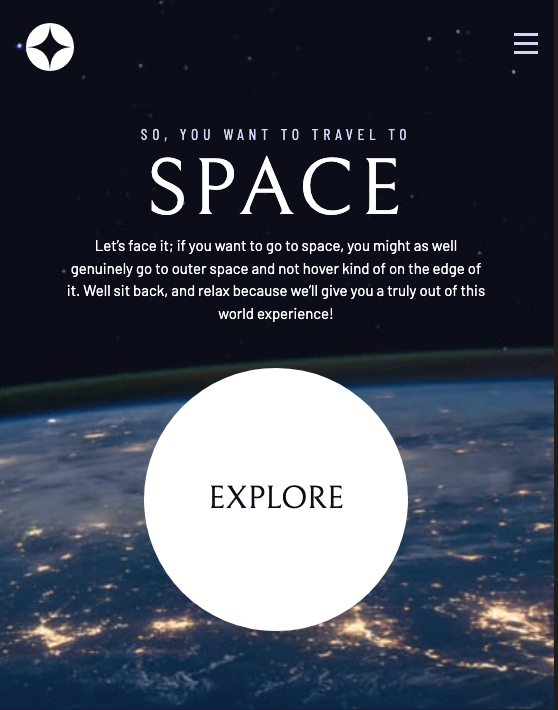
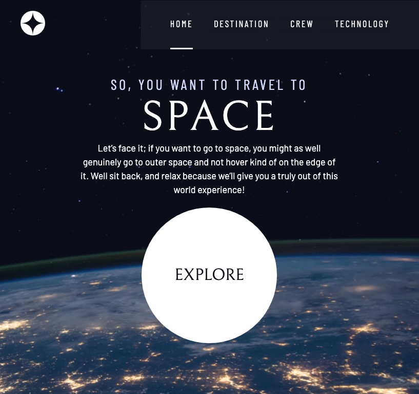

# Space Website
My solution to the JavaScript Exercises from The Odin Project

## Table of Contents
[Introduction](Introduction)

[Motivation](Motivation)

[Built With](BuiltWith)

[My Solution](MySolution)

[Screenshots](Screenshots)

[Acknowledgements](Acknowledgements)

## Introduction
Welcome to my Space Tourism Website. This challenge was created by [Scrimba](https://scrimba.com/) and [FrontEnd Mentor](https://www.frontendmentor.io/). The goal of this challenge is to create a multi page website as close to the design files as possible. 

The challenge began with blank files and included the following features- the the user should be able to view the optimal layout for each of the website’s pages depending on the user’s screen size, see the hover states for all interactive elements on the page, view each page and toggle between the tabs to see new content. It also included interactive elements as well as working accessibility features into the site.

## Motivation
I began this course to review my HTML, CSS, and JavaScript skills. To see how far I could get before referring to the videos. I chose this course because it was a clearly defined project with designed files provided. It provided a challenge of creating and implementing a design system with videos available to check in with. 

## Built With
- JavaScript
- HTML
- CSS

## My Solution
[Solution](https://scrimba.com/scrim/co1134e79b2debb30318bfcda)

## Screenshots

Mobile:

Tablet:

Desktop:

## Acknowledgements
[Scrimba](https://scrimba.com/) and [FrontEnd Mentor](https://www.frontendmentor.io/) for putting together this challenge
